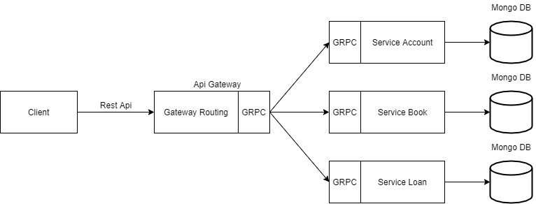

# Microservice Solution

Microservice Solution

> You can see it also through Google Docs - [Link](https://docs.google.com/document/d/1Yk2Iqmctj-I8hOPizn76XISDUxizhfg6q6SkhrKPZL4/edit?usp=sharing)



## Run Project

### Run API Gateway

```bash
go run cmd\main.go
```

### Run Account Service

```bash
go run serviceAccountClient\serviceAccount.go
```

### Run Book Service

```bash
go run serviceBookClient\serviceBook.go
```

### Run Loan Service

```bash
go run serviceLoanClient\serviceLoan.go
```

## Run Test

```bash
make test
```

Or

```bash
go test -v ./... -cover
```

## Example Request and Response

### Account Service

#### Create Account

| Method | URL                             |
| ------ | ------------------------------- |
| `POST` | `http://localhost:8080/account` |

##### Body Request

```json
{
  "name": "Maxwel Munthes",
  "address": "jalan jalan",
  "phone_number": "+628226655551"
}
```

##### Response

###### Success (200)

```json
{
  "status": "OK",
  "data": {
    "account": {
      "id": "5f82d73178ae30da47f70d8c",
      "name": "Maxwel Munthes",
      "address": "jalan jalan",
      "phone_number": "+628226655551"
    }
  },
  "accessTime": "11-10-2020 16:58:09"
}
```

###### Error Bad Request (400)

```json
{
  "status": "Bad Request",
  "data": <error-massage>,
  "accessTime": "11-10-2020 16:58:09"
}
```

###### Error Internal Server Error (500)

```json
{
  "status": "Internal Server Error",
  "data": <error-massage>,
  "accessTime": "11-10-2020 16:58:09"
}
```

#### Read Account

| Method | URL                                          |
| ------ | -------------------------------------------- |
| `GET` | `http://localhost:8080/account/{account-id}` |

##### Body Request

`-`

##### Response

###### Success (200)

```json
{
  "status": "OK",
  "data": {
    "account": {
      "id": "5f82d73178ae30da47f70d8c",
      "name": "Maxwel Munthes",
      "address": "jalan jalan",
      "phone_number": "+628226655551"
    }
  },
  "accessTime": "11-10-2020 17:02:41"
}
```

###### Error Bad Request (400)

```json
{
  "status": "Bad Request",
  "data": <error-massage>,
  "accessTime": "11-10-2020 16:58:09"
}
```

###### Error Internal Server Error (500)

```json
{
  "status": "Internal Server Error",
  "data": <error-massage>,
  "accessTime": "11-10-2020 16:58:09"
}
```

#### Update Account

| Method | URL                             |
| ------ | ------------------------------- |
| `POST` | `http://localhost:8080/account` |

##### Body Request

```json
{
  "id":"5f82d73178ae30da47f70d8c",
  "name": "Munthes",
  "address": "jalan jalan",
  "phone_number": "+628226655551"
}
```

##### Response

###### Success (200)

```json
{
  "status": "OK",
  "data": {
    "account": {
      "id": "5f82d73178ae30da47f70d8c",
      "name": "Munthes",
      "address": "jalan jalan",
      "phone_number": "+628226655551"
    }
  },
  "accessTime": "11-10-2020 17:04:29"
}
```

###### Error Bad Request (400)

```json
{
  "status": "Bad Request",
  "data": <error-massage>,
  "accessTime": "11-10-2020 16:58:09"
}
```

###### Error Internal Server Error (500)

```json
{
  "status": "Internal Server Error",
  "data": <error-massage>,
  "accessTime": "11-10-2020 16:58:09"
}
```

#### Delete Account

| Method | URL                                          |
| ------ | -------------------------------------------- |
| `POST` | `http://localhost:8080/account/delete/{account-id}` |

##### Body Request

`-`

##### Response

###### Success (200)

```json
{
  "status": "OK",
  "data": {
    "success": true
  },
  "accessTime": "11-10-2020 17:02:41"
}
```

###### Error Bad Request (400)

```json
{
  "status": "Bad Request",
  "data": <error-massage>,
  "accessTime": "11-10-2020 16:58:09"
}
```

###### Error Internal Server Error (500)

```json
{
  "status": "Internal Server Error",
  "data": <error-massage>,
  "accessTime": "11-10-2020 16:58:09"
}
```

### Book Service

#### Create Book

| Method | URL                          |
| ------ | ---------------------------- |
| `POST` | `http://localhost:8080/book` |

##### Body Request

```json
{
  "author": "Maxwel Natanael",
  "title": "dictionary",
  "description": "this is book"
}
```

##### Response

###### Success (200)

```json
{
  "status": "OK",
  "data": {
    "book": {
      "id": "5f82d9d873f6f37ad0b703c0",
      "author": "Maxwel Natanael",
      "title": "dictionary",
      "description": "this is book"
    }
  },
  "accessTime": "11-10-2020 17:09:28"
}
```

###### Error Bad Request (400)

```json
{
  "status": "Bad Request",
  "data": <error-massage>,
  "accessTime": "11-10-2020 16:58:09"
}
```

###### Error Internal Server Error (500)

```json
{
  "status": "Internal Server Error",
  "data": <error-massage>,
  "accessTime": "11-10-2020 16:58:09"
}
```

#### Read Book

| Method | URL                                    |
| ------ | -------------------------------------- |
| `GET`  | `http://localhost:8080/book/{book-id}` |

##### Body Request

`-`

##### Response

###### Success (200)

```json
{
  "status": "OK",
  "data": {
    "book": {
      "id": "5f82d9d873f6f37ad0b703c0",
      "author": "Maxwel Natanael",
      "title": "dictionary",
      "description": "this is book"
    }
  },
  "accessTime": "11-10-2020 17:11:20"
}
```

###### Error Bad Request (400)

```json
{
  "status": "Bad Request",
  "data": <error-massage>,
  "accessTime": "11-10-2020 16:58:09"
}
```

###### Error Internal Server Error (500)

```json
{
  "status": "Internal Server Error",
  "data": <error-massage>,
  "accessTime": "11-10-2020 16:58:09"
}
```

#### Update Book

| Method | URL                          |
| ------ | ---------------------------- |
| `POST` | `http://localhost:8080/book` |

##### Body Request

```json
{
  "id": "5f82d9d873f6f37ad0b703c0",
  "author": "Natanael",
  "title": "dictionary",
  "description": "this is book"
}
```

##### Response

###### Success (200)

```json
{
  "status": "OK",
  "data": {
    "book": {
      "id": "5f82d9d873f6f37ad0b703c0",
      "author": "Natanael",
      "title": "dictionary",
      "description": "this is book"
    }
  },
  "accessTime": "11-10-2020 17:14:18"
}
```

###### Error Bad Request (400)

```json
{
  "status": "Bad Request",
  "data": <error-massage>,
  "accessTime": "11-10-2020 16:58:09"
}
```

###### Error Internal Server Error (500)

```json
{
  "status": "Internal Server Error",
  "data": <error-massage>,
  "accessTime": "11-10-2020 16:58:09"
}
```

#### Delete Account

| Method | URL                                           |
| ------ | --------------------------------------------- |
| `POST` | `http://localhost:8080/book/delete/{book-id}` |

##### Body Request

`-`

##### Response

###### Success (200)

```json
{
  "status": "OK",
  "data": {
    "success": true
  },
  "accessTime": "11-10-2020 17:02:41"
}
```

###### Error Bad Request (400)

```json
{
  "status": "Bad Request",
  "data": <error-massage>,
  "accessTime": "11-10-2020 16:58:09"
}
```

###### Error Internal Server Error (500)

```json
{
  "status": "Internal Server Error",
  "data": <error-massage>,
  "accessTime": "11-10-2020 16:58:09"
}
```

### Loan Service

#### Create Loan

| Method | URL                          |
| ------ | ---------------------------- |
| `POST` | `http://localhost:8080/loan` |

##### Body Request

```json
{
  "name": "Maxwel Natanael",
  "book_name": "dictionary",
  "loan_duration": "3"
}
```

##### Response

###### Success (200)

```json
{
  "status": "OK",
  "data": {
    "loan": {
      "id": "5f82dca3be73275865fec356",
      "name": "Maxwel Natanael",
      "book_name": "dictionary",
      "loan_duration": "3"
    }
  },
  "accessTime": "11-10-2020 17:21:23"
}
```

###### Error Bad Request (400)

```json
{
  "status": "Bad Request",
  "data": <error-massage>,
  "accessTime": "11-10-2020 16:58:09"
}
```

###### Error Internal Server Error (500)

```json
{
  "status": "Internal Server Error",
  "data": <error-massage>,
  "accessTime": "11-10-2020 16:58:09"
}
```

#### Read Loan

| Method | URL                                    |
| ------ | -------------------------------------- |
| `GET`  | `http://localhost:8080/loan/{loan-id}` |

##### Body Request

`-`

##### Response

###### Success (200)

```json
{
  "status": "OK",
  "data": {
    "loan": {
      "id": "5f82dca3be73275865fec356",
      "name": "Maxwel Natanael",
      "book_name": "dictionary",
      "loan_duration": "3"
    }
  },
  "accessTime": "11-10-2020 17:22:51"
}
```

###### Error Bad Request (400)

```json
{
  "status": "Bad Request",
  "data": <error-massage>,
  "accessTime": "11-10-2020 16:58:09"
}
```

###### Error Internal Server Error (500)

```json
{
  "status": "Internal Server Error",
  "data": <error-massage>,
  "accessTime": "11-10-2020 16:58:09"
}
```

#### Update Loan

| Method | URL                          |
| ------ | ---------------------------- |
| `POST` | `http://localhost:8080/book` |

##### Body Request

```json
{
  "id": "5f82dca3be73275865fec356",
  "name": "Maxwel Natanaelos",
  "book_name": "dictionary",
  "loan_duration": "3"
}
```

##### Response

###### Success (200)

```json
{
  "status": "OK",
  "data": {
    "loan": {
      "id": "5f82dca3be73275865fec356",
      "name": "Maxwel Natanaelos",
      "book_name": "dictionary",
      "loan_duration": "3"
    }
  },
  "accessTime": "11-10-2020 17:23:26"
}
```

###### Error Bad Request (400)

```json
{
  "status": "Bad Request",
  "data": <error-massage>,
  "accessTime": "11-10-2020 16:58:09"
}
```

###### Error Internal Server Error (500)

```json
{
  "status": "Internal Server Error",
  "data": <error-massage>,
  "accessTime": "11-10-2020 16:58:09"
}
```

#### Delete Loan

| Method | URL                                           |
| ------ | --------------------------------------------- |
| `POST` | `http://localhost:8080/loan/delete/{loan-id}` |

##### Body Request

`-`

##### Response

###### Success (200)

```json
{
  "status": "OK",
  "data": {
    "success": true
  },
  "accessTime": "11-10-2020 17:02:41"
}
```

###### Error Bad Request (400)

```json
{
  "status": "Bad Request",
  "data": <error-massage>,
  "accessTime": "11-10-2020 16:58:09"
}
```

###### Error Internal Server Error (500)

```json
{
  "status": "Internal Server Error",
  "data": <error-massage>,
  "accessTime": "11-10-2020 16:58:09"
}
```